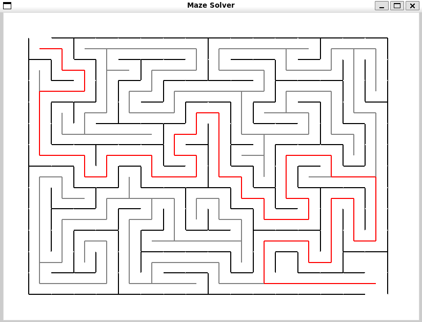

# Maze-Solver

This is a both a random maze generator and solver at the same time. It uses the depth first search algorithm to solve the given maze. 



Note that the maze generator is random so the maze could be unsolvable, in such cases the algorithm it would still work but it will output that the maze is unsolvable.

## Requirements:

- Python 3
- Tkinter, more info at:
  ```bash
    https://tkdocs.com/tutorial/install.html#install-win-python
  ```


## Instructions:

1. Make sure the main.sh has execution rights with command:
```bash
chmod +x main.sh
```

2. Run the script with:
```bash
./main.sh
```
  This will open the Tkinter gui, start generating the maze and solving it marking each traversed path.

## Testing:

1. Same as main script, make sure test.sh has execution rights with command:
```bash
chmod +x test.sh
```

2. Run all unit tests with command:

```bash
./test.sh
```